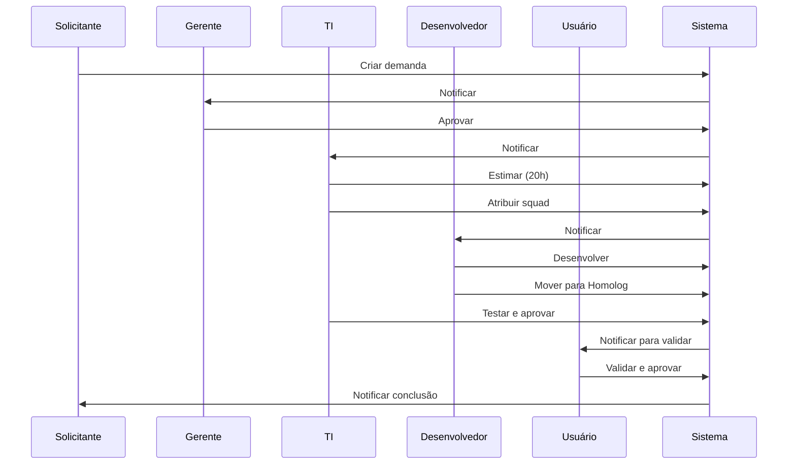

# Exemplos Práticos de Uso
## Sistema de Gestão de Demandas de TI

Este documento apresenta casos reais de uso do sistema com exemplos detalhados de como executar cada ação.

---

## 📋 Índice de Exemplos

1. [Criação de Demandas](#1-criação-de-demandas)
2. [Processo de Aprovação](#2-processo-de-aprovação)
3. [Gestão Técnica](#3-gestão-técnica)
4. [Uso do Kanban](#4-uso-do-kanban)
5. [Cerimônias Ágeis](#5-cerimônias-ágeis)
6. [Relatórios e Análises](#6-relatórios-e-análises)
7. [Gestão de Permissões](#7-gestão-de-permissões)

---

## 1. Criação de Demandas

### Exemplo 1.1: Nova Funcionalidade Simples

**Contexto**: Departamento de Vendas precisa de um novo relatório.

**Passos**:
```yaml
1. Acesso:
   - Menu > Demandas > Criar Demanda

2. Preenchimento:
   Descrição: "Relatório de Vendas por Vendedor com Filtro de Período"
   
   Detalhamento:
   "Necessito de um relatório que mostre:
   - Lista de vendedores
   - Total de vendas por vendedor no período
   - Quantidade de clientes atendidos
   - Ticket médio
   - Filtros: data início, data fim, vendedor específico
   - Exportação para Excel e PDF"
   
   Departamento: "Comercial"
   Empresa: "Empresa A"
   Classificação: "Relatório"
   Prioridade: "Média"
   Regulatório: "Não"

3. Anexos:
   - mockup_relatorio.png (tela desejada)
   - especificacao_campos.xlsx (campos necessários)

4. Ação:
   - Salvar como Rascunho (para revisar)
   OU
   - Enviar para Aprovação (se estiver completo)
```

**Resultado Esperado**:
- Demanda criada com código automático (ex: EMA-2025-001)
- Email automático enviado para o gerente da área
- Status: "Aguardando Aprovação Gerencial"

---

### Exemplo 1.2: Demanda Regulatória com Prazo

**Contexto**: Compliance precisa adequação à LGPD urgente.

**Passos**:
```yaml
1. Preenchimento:
   Descrição: "Implementar Relatório de Consentimento LGPD"
   
   Detalhamento:
   "Conforme exigência da ANPD, precisamos:
   - Relatório de consentimentos coletados
   - Data/hora da coleta
   - Finalidade específica
   - Base legal aplicada
   - Registro de revogações
   - Trilha de auditoria completa"
   
   Classificação: "Regulatório"
   Prioridade: "Crítica"
   Regulatório: "Sim"
   Data Limite: "31/03/2025"
   
   Justificativa:
   "Notificação oficial ANPD processo nº 12345/2024
   Prazo legal improrrogável"

2. Anexos:
   - notificacao_anpd.pdf
   - lei_lgpd_art13.pdf
   - modelo_relatorio.docx
```

**Comportamento Especial**:
- Demanda marcada visualmente como REGULATÓRIA
- Alertas automáticos 7 dias antes do prazo
- Escalonamento automático se não movimentada
- Prioridade visual diferenciada no Kanban

---

### Exemplo 1.3: Projeto Grande com Múltiplas Fases

**Contexto**: Novo módulo de CRM completo.

**Passos**:
```yaml
1. Descrição Estruturada:
   Título: "Desenvolvimento Módulo CRM - Gestão de Clientes"
   
   Escopo Macro:
   "Sistema completo de CRM incluindo:
   
   FASE 1 - Cadastros Base (Sprint 1-2):
   - Cadastro de clientes
   - Cadastro de contatos
   - Histórico de interações
   
   FASE 2 - Oportunidades (Sprint 3-4):
   - Pipeline de vendas
   - Funil de conversão
   - Previsão de receita
   
   FASE 3 - Automação (Sprint 5-6):
   - Email marketing
   - Workflows automáticos
   - Notificações inteligentes
   
   FASE 4 - Relatórios (Sprint 7-8):
   - Dashboard executivo
   - Análises de performance
   - Exportações"
   
   Tipo de Projeto: "Grande"
   Classificação: "Nova Funcionalidade"
   Prioridade: "Alta"
   
   Benefício Esperado:
   "- Redução de 40% no tempo de gestão de leads
   - Aumento de 25% na taxa de conversão
   - Visibilidade completa do funil de vendas"

2. Documentação Anexa:
   - projeto_crm_completo.pdf (60 páginas)
   - fluxogramas_processos.png
   - requisitos_funcionais.docx
   - casos_uso_detalhados.xlsx
   - mockups_telas/ (pasta com 20 imagens)
```

**Fluxo Após Aprovação**:
1. Gerente aprova
2. Vai para Comitê (por ser projeto grande)
3. Comitê aprova e prioriza
4. TI recebe para estimativa
5. Tech Lead faz faseamento em 8 sprints
6. Cada fase vira uma demanda filha

---

## 2. Processo de Aprovação

### Exemplo 2.1: Aprovação Gerencial - Aprovando

**Contexto**: Gerente avalia demanda do seu departamento.

**Passos**:
```yaml
1. Acesso:
   - Menu > Aprovações
   - Ou: Clique na notificação recebida

2. Análise:
   - Ler descrição completa
   - Verificar anexos
   - Avaliar necessidade vs prioridade
   - Verificar alinhamento com objetivos

3. Decisão - Aprovar:
   - Clique em "Aprovar"
   - (Opcional) Adicione comentário:
     "Aprovado. Demanda alinhada com OKR Q1 2025 
     do departamento comercial. Prioridade confirmada 
     como Média."
   - Confirme

4. Ação Automática do Sistema:
   - Demanda move para "Aguardando Comitê"
   - Email enviado para membros do comitê
   - Notificação in-app para comitê
   - Histórico registrado
   - Solicitante notificado do progresso
```

**Tela de Aprovação - Campos Visíveis**:
```
╔════════════════════════════════════════════════╗
║ DEMANDA EMA-2025-001                           ║
║ Relatório de Vendas por Vendedor               ║
╠════════════════════════════════════════════════╣
║                                                ║
║ Solicitante: João Silva                        ║
║ Departamento: Comercial                        ║
║ Data: 15/01/2025                               ║
║ Prioridade: Média                              ║
║                                                ║
║ [Descrição Completa]                           ║
║ [Anexos: 2 arquivos]                           ║
║ [Histórico: 1 ação]                            ║
║                                                ║
║ ┌──────────┐ ┌────────────────┐ ┌──────────┐  ║
║ │ APROVAR  │ │ SOLICITAR INFO │ │ RECUSAR  │  ║
║ └──────────┘ └────────────────┘ └──────────┘  ║
╚════════════════════════════════════════════════╝
```

---

### Exemplo 2.2: Aprovação Gerencial - Solicitando Insumos

**Contexto**: Demanda está incompleta ou necessita mais informações.

**Passos**:
```yaml
1. Identificação do Problema:
   - Descrição vaga: "Preciso de um relatório"
   - Falta especificação de campos
   - Sem anexos/mockups

2. Solicitação de Insumos:
   - Clique em "Solicitar Insumos"
   - Preencha formulário:
   
   Comentário:
   "Prezado João,
   
   Para avaliar adequadamente, preciso das seguintes 
   informações:
   
   1. Quais campos específicos devem aparecer no relatório?
   2. Qual formato de exportação (Excel/PDF/ambos)?
   3. Há necessidade de gráficos? Se sim, quais tipos?
   4. Quem são os usuários que terão acesso?
   5. Com que frequência será utilizado?
   
   Por favor, anexe também um mockup ou exemplo de 
   relatório similar se possível.
   
   Aguardo retorno para prosseguir com aprovação.
   
   Atenciosamente,
   Maria Santos - Gerente Comercial"
   
   - Confirme

3. Comportamento do Sistema:
   - Demanda volta para "Rascunho"
   - Marca como "Aguardando Insumos"
   - Solicitante recebe notificação
   - Timer de SLA pausado
   - Prazo de 5 dias para resposta
```

---

### Exemplo 2.3: Aprovação de Comitê

**Contexto**: Comitê avalia demanda de alto impacto.

**Passos**:
```yaml
1. Reunião de Comitê:
   Data: Todas as terças, 14h
   Participantes: 5 membros (Diretoria, TI, Financeiro, etc)

2. Avaliação Criteriosa:
   
   Critérios Analisados:
   ✓ Alinhamento Estratégico
     - Projeto CRM está no planejamento 2025? SIM
     - Alinhado com objetivos corporativos? SIM
     - Patrocinador executivo? SIM (Diretor Comercial)
   
   ✓ Viabilidade Técnica
     - Equipe tem capacidade? PARCIAL
     - Tecnologia disponível? SIM
     - Riscos técnicos? MÉDIOS
   
   ✓ Viabilidade Financeira
     - Orçamento disponível? SIM
     - ROI esperado? 18 meses
     - Custo vs Benefício? POSITIVO
   
   ✓ Priorização
     - Urgência: ALTA
     - Importância: CRÍTICA
     - Dependências: NENHUMA
   
   Decisão: APROVAR

3. Registro no Sistema:
   - Cada membro vota: Aprovar/Recusar/Abstenção
   - 80%+ aprovação = APROVADA
   - < 80% = RECUSADA ou volta para análise
   
   Votos:
   - Diretor TI: APROVAR
   - Diretor Comercial: APROVAR
   - CFO: APROVAR (com ressalvas de orçamento)
   - CTO: APROVAR
   - Compliance: ABSTENÇÃO
   
   Resultado: 4/5 = 80% = APROVADA

4. Comentário do Comitê:
   "Projeto aprovado com ressalvas:
   - Orçamento limitado a R$ 250.000
   - Prazo máximo de 8 sprints (4 meses)
   - Revisão de progresso mensal obrigatória
   - Piloto em 1 regional antes de rollout nacional
   
   Patrocinador: Diretor Comercial
   Gestor do Projeto: Tech Lead TI"
```

---

## 3. Gestão Técnica

### Exemplo 3.1: Parecer Técnico Detalhado

**Contexto**: Tech Lead avalia viabilidade técnica.

**Formulário de Parecer**:
```yaml
Demanda: EMA-2025-025 - Módulo CRM

1. Análise de Complexidade:
   Complexidade: ALTA
   
   Justificativa:
   "Sistema complexo envolvendo:
   - 15 tabelas novas no banco
   - 40+ endpoints API REST
   - 25 telas frontend
   - Integrações: Email (SendGrid), WhatsApp, API CEP
   - Relatórios complexos com agregações
   - Dashboard com gráficos tempo real"

2. Viabilidade Técnica:
   Viável: SIM
   
   Tecnologias Necessárias:
   - Frontend: React existente ✓
   - Backend: Node.js existente ✓
   - Banco: PostgreSQL existente ✓
   - Cache: Redis (NOVO - precisa provisionar)
   - Fila: RabbitMQ (NOVO - precisa provisionar)
   - Storage: S3 para anexos ✓
   
   Dependências Externas:
   - API SendGrid (contrato ativo) ✓
   - API WhatsApp Business (precisa contratar) ✗
   - API de geolocalização (usar Google Maps) ✓

3. Estimativa Inicial:
   Horas Totais: 640 horas
   
   Breakdown:
   - Análise e Design: 40h
   - Desenvolvimento Backend: 200h
   - Desenvolvimento Frontend: 180h
   - Integrações: 80h
   - Testes: 80h
   - Documentação: 40h
   - Deploy e Ajustes: 20h
   
   Equipe Sugerida:
   - 1 Tech Lead (20% alocação)
   - 2 Desenvolvedores Backend (100%)
   - 2 Desenvolvedores Frontend (100%)
   - 1 QA (50%)
   
   Duração Estimada: 8 sprints (4 meses)

4. Riscos Identificados:
   ALTO:
   - Integração WhatsApp pode ter restrições de API
   - Volume de dados pode impactar performance
   
   MÉDIO:
   - Equipe nunca trabalhou com RabbitMQ
   - Design de UX complexo pode gerar retrabalho
   
   BAIXO:
   - Hospedagem adicional para Redis

5. Recomendações:
   - Fazer POC da integração WhatsApp antes (1 sprint)
   - Implementar cache desde início
   - Fazer testes de carga em cada sprint
   - Piloto com 20 usuários antes de produção
   - Documentação contínua

6. Arquitetura Proposta:
   [Anexo: diagrama_arquitetura_crm.png]
   
   Padrões:
   - Clean Architecture
   - Repository Pattern
   - Event-Driven para notificações
   - CQRS para relatórios pesados

7. Custo Estimado:
   Desenvolvimento: R$ 128.000 (640h × R$ 200/h)
   Infraestrutura (4 meses): R$ 2.000
   Serviços Terceiros: R$ 1.500/mês
   Total Projeto: R$ 136.000
   
   Custo Mensal Recorrente: R$ 2.000

8. Decisão:
   APROVAR com ressalvas acima
   
   Próximos Passos:
   1. POC WhatsApp API (Sprint 0)
   2. Faseamento detalhado
   3. Alocação de equipe
   4. Setup de ambiente
```

**Ação do Sistema**:
- Demanda recebe parecer técnico
- Marca como "Parecer TI Concluído"
- Vai para estimativa formal
- Disponível para faseamento

---

### Exemplo 3.2: Faseamento em Sprints

**Contexto**: Dividir projeto grande em sprints executáveis.

**Interface de Faseamento**:
```yaml
Projeto: Módulo CRM
Total de Horas: 640h
Sprints Disponíveis: 8

Sprint 0 (Preparação):
  Nome: "POC e Setup"
  Duração: 2 semanas
  Horas: 40h
  Objetivos:
    - POC integração WhatsApp
    - Setup Redis e RabbitMQ
    - Configuração de ambientes
    - Definição de padrões
  Entregável: "Ambiente pronto + POC validada"
  
Sprint 1 (Fundação):
  Nome: "Cadastros Base"
  Duração: 2 semanas
  Horas: 80h
  Objetivos:
    - Banco de dados completo
    - API CRUD de clientes
    - API CRUD de contatos
    - Tela de listagem
    - Tela de cadastro
  Entregável: "Módulo de cadastros funcionando"
  Dependências: Sprint 0
  
Sprint 2 (Cadastros Avançados):
  Nome: "Histórico e Interações"
  Duração: 2 semanas
  Horas: 80h
  Objetivos:
    - Timeline de interações
    - Registro de ligações
    - Registro de emails
    - Anexos de documentos
  Entregável: "Histórico completo de cliente"
  Dependências: Sprint 1

Sprint 3 (Oportunidades Base):
  Nome: "Pipeline de Vendas"
  Duração: 2 semanas
  Horas: 80h
  Objetivos:
    - Gestão de oportunidades
    - Estágios do funil
    - Kanban de negociações
    - Previsão de fechamento
  Entregável: "Funil de vendas operacional"
  Dependências: Sprint 2

Sprint 4 (Oportunidades Avançadas):
  Nome: "Automações e Conversões"
  Duração: 2 semanas
  Horas: 80h
  Objetivos:
    - Cálculo automático de score
    - Regras de movimentação
    - Notificações automáticas
    - Relatório de conversão
  Entregável: "Pipeline inteligente"
  Dependências: Sprint 3

Sprint 5 (Integrações):
  Nome: "Email e WhatsApp"
  Duração: 2 semanas
  Horas: 80h
  Objetivos:
    - Integração SendGrid
    - Integração WhatsApp
    - Templates de mensagens
    - Histórico integrado
  Entregável: "Comunicação automatizada"
  Dependências: Sprint 4

Sprint 6 (Workflows):
  Nome: "Automações de Processo"
  Duração: 2 semanas
  Horas: 80h
  Objetivos:
    - Editor de workflows
    - Triggers automáticos
    - Ações configuráveis
    - Testes de workflows
  Entregável: "Automação completa"
  Dependências: Sprint 5

Sprint 7 (Relatórios):
  Nome: "Dashboards e Análises"
  Duração: 2 semanas
  Horas: 80h
  Objetivos:
    - Dashboard executivo
    - Relatórios de performance
    - Análises de funil
    - Exportações
  Entregável: "BI completo"
  Dependências: Sprint 6

Sprint 8 (Finalização):
  Nome: "Refinamento e Produção"
  Duração: 2 semanas
  Horas: 40h
  Objetivos:
    - Ajustes de performance
    - Correção de bugs
    - Documentação final
    - Treinamento de usuários
    - Deploy em produção
  Entregável: "Sistema em produção"
  Dependências: Sprint 7

Resumo:
- Total: 8 sprints
- Duração: 4 meses
- 640 horas
- Entregas incrementais a cada 2 semanas
```

**Benefícios do Faseamento**:
- ✓ Entregas incrementais
- ✓ Validação contínua com usuários
- ✓ Ajustes de rota possíveis
- ✓ Gerenciamento de risco
- ✓ Visibilidade de progresso

---

## 4. Uso do Kanban

### Exemplo 4.1: Movimentação Manual de Cards

**Contexto**: Tech Lead organizando demandas no Kanban.

**Colunas do Kanban**:
```
┌───────────┬───────────┬───────────┬───────────┬───────────┐
│  Backlog  │  Análise  │   Desen   │  Homolog  │ Concluído │
│   (15)    │    (3)    │    (5)    │    (2)    │   (120)   │
├───────────┼───────────┼───────────┼───────────┼───────────┤
│ EMA-001   │ EMA-015   │ EMA-020   │ EMA-025   │ EMA-030   │
│ Pri: Alta │ Pri: Alta │ Pri: Média│ Pri: Alta │           │
│ 40h       │ 80h       │ 20h       │ 60h       │           │
│           │           │           │           │           │
│ EMA-002   │ EMA-016   │ EMA-021   │ EMA-026   │           │
│ Pri: Média│ Pri:Críti │ Pri: Baixa│ Pri: Média│           │
│ 20h       │ 120h      │ 8h        │ 40h       │           │
│           │           │           │           │           │
│ ...       │ EMA-017   │ EMA-022   │           │           │
│           │ Pri: Média│ Pri: Alta │           │           │
│           │ 60h       │ 30h       │           │           │
│           │           │           │           │           │
│           │           │ EMA-023   │           │           │
│           │           │ Pri: Baixa│           │           │
│           │           │ 15h       │           │           │
│           │           │           │           │           │
│           │           │ EMA-024   │           │           │
│           │           │ Pri: Média│           │           │
│           │           │ 25h       │           │           │
└───────────┴───────────┴───────────┴───────────┴───────────┘
```

**Ação: Mover EMA-020 de Desenvolvimento para Homologação**

Passos:
1. Clique e arraste o card EMA-020
2. Solte na coluna "Homolog"
3. Sistema valida:
   - ✓ Desenvolvedor marcou como concluído?
   - ✓ Testes unitários passaram?
   - ✓ Code review aprovado?
4. Se validações OK:
   - Move o card
   - Registra no histórico
   - Notifica QA
   - Atualiza métricas

**Validações Automáticas por Transição**:
```yaml
Backlog → Análise:
  - Squad deve estar alocada
  - Estimativa deve existir

Análise → Desenvolvimento:
  - Parecer técnico completo
  - Faseamento definido
  - Desenvolvedor atribuído

Desenvolvimento → Homologação:
  - Código commitado
  - Testes passando
  - Code review aprovado

Homologação → Concluído:
  - QA testou e aprovou
  - Usuário validou
  - Deploy em produção OK
```

---

### Exemplo 4.2: Uso de Filtros no Kanban

**Contexto**: Visualizar apenas demandas específicas.

**Filtros Disponíveis**:
```yaml
Filtro por Empresa:
  Opções: Todas | Empresa A | Empresa B | Empresa C
  Resultado: Mostra apenas cards da empresa selecionada

Filtro por Squad:
  Opções: Todas | Frontend | Backend | Mobile | DevOps
  Resultado: Demandas atribuídas ao squad

Filtro por Prioridade:
  Opções: Todas | Crítica | Alta | Média | Baixa
  Resultado: Demandas com prioridade selecionada

Filtro por Sprint:
  Opções: Todas | Sprint 1 | Sprint 2 | ...
  Resultado: Demandas do sprint específico

Filtro por Regulatório:
  Opções: Todas | Só Regulatórias | Não Regulatórias
  Resultado: Filtra por tipo regulatório

Busca Rápida:
  Campo de texto livre
  Busca em: código, descrição, solicitante
```

**Exemplo de Filtro Combinado**:
```
Empresa: Empresa A
Squad: Backend
Prioridade: Alta ou Crítica
Sprint: Sprint Atual

Resultado: 3 demandas
```

---

## 5. Cerimônias Ágeis

### Exemplo 5.1: Planning de Sprint

**Contexto**: Planejamento quinzenal da sprint.

**Agenda da Planning**:
```yaml
Data: Segunda-feira, 09h00
Duração: 2 horas
Participantes:
  - Tech Lead (facilitador)
  - Squad completo (6 pessoas)
  - Product Owner (stakeholder)
  - Scrum Master

Parte 1 - Review do Backlog (30min):
  1. PO apresenta demandas priorizadas
  2. Equipe faz perguntas
  3. Esclarecimentos técnicos

Parte 2 - Seleção de Demandas (45min):
  Capacidade da Sprint:
    - 2 semanas = 10 dias úteis
    - 6 pessoas × 6h/dia × 10 dias = 360h teóricas
    - Redução por reuniões/imprevistos: -20% = 288h práticas
  
  Demandas Selecionadas:
    ✓ EMA-045: API de Produtos (80h)
    ✓ EMA-046: Tela de Listagem (40h)
    ✓ EMA-047: Filtros Avançados (30h)
    ✓ EMA-048: Exportação Excel (20h)
    ✓ EMA-049: Correções de Bugs (40h)
    ✓ Buffer: 15% (43h)
    Total: 253h de 288h disponíveis

Parte 3 - Planejamento Detalhado (45min):
  Cada demanda é quebrada em tarefas:
  
  EMA-045: API de Produtos (80h)
    □ Modelagem do banco (8h) - João
    □ Endpoints CRUD (24h) - Maria
    □ Validações (12h) - Pedro
    □ Testes unitários (16h) - João
    □ Documentação API (8h) - Maria
    □ Code review (4h) - Tech Lead
    □ Deploy staging (4h) - DevOps
    □ Teste integração (4h) - QA

Meta da Sprint:
  "Entregar módulo de produtos completo com CRUD, 
   validações e 95% de cobertura de testes"
```

**Registro no Sistema**:
```yaml
Menu > Cerimônias > Planning > Nova Planning

Formulário:
  Data: 20/01/2025
  Sprint: Sprint 5
  Squad: Backend
  
  Demandas Selecionadas:
    [x] EMA-045 (80h)
    [x] EMA-046 (40h)
    [x] EMA-047 (30h)
    [x] EMA-048 (20h)
    [x] EMA-049 (40h)
  
  Total: 210h de 288h (73% de capacidade)
  
  Meta da Sprint:
    "Entregar módulo de produtos completo com CRUD, 
     validações e 95% de cobertura de testes"
  
  Participantes:
    - João Silva
    - Maria Santos
    - Pedro Oliveira
    - Ana Costa
    - Carlos Souza
    - Tech Lead
  
  Observações:
    "Considerado buffer de 15% para imprevistos.
     Maria de férias dias 25-28/01, ajustar carga."

[Salvar Planning]
```

**Ação Automática do Sistema**:
- Demandas movidas para "Sprint Atual"
- Atribuições registradas
- Calendário atualizado
- Email de convite enviado
- Kanban filtrado para sprint

---

### Exemplo 5.2: Daily Standup

**Contexto**: Reunião diária rápida (15min).

**Formato da Daily**:
```yaml
Data: Terça-feira, 09h15
Participantes: Squad Backend (6 pessoas)
Facilitador: Scrum Master

┌─────────────────────────────────────────────────┐
│ JOÃO SILVA - Backend Developer                  │
├─────────────────────────────────────────────────┤
│ Ontem:                                          │
│ ✓ Finalizei modelagem do banco EMA-045         │
│ ✓ Iniciei endpoints CRUD                        │
│                                                 │
│ Hoje:                                           │
│ □ Continuar endpoints CRUD (50% completo)       │
│ □ Iniciar testes unitários                      │
│                                                 │
│ Impedimentos:                                   │
│ ⚠ Aguardando definição de regra de validação   │
│    específica com PO                            │
└─────────────────────────────────────────────────┘

┌─────────────────────────────────────────────────┐
│ MARIA SANTOS - Backend Developer                │
├─────────────────────────────────────────────────┤
│ Ontem:                                          │
│ ✓ Finalizei EMA-046 tela de listagem           │
│ ✓ Code review da modelagem do João             │
│                                                 │
│ Hoje:                                           │
│ □ Iniciar EMA-047 filtros avançados            │
│ □ Documentar API de EMA-046                     │
│                                                 │
│ Impedimentos:                                   │
│ ✗ Nenhum                                        │
└─────────────────────────────────────────────────┘

┌─────────────────────────────────────────────────┐
│ PEDRO OLIVEIRA - Backend Developer              │
├─────────────────────────────────────────────────┤
│ Ontem:                                          │
│ ✓ Corrigi 3 bugs de EMA-049                    │
│ ✓ Deploy de correções em staging               │
│                                                 │
│ Hoje:                                           │
│ □ Continuar correções de bugs                   │
│ □ Apoiar João nas validações                    │
│                                                 │
│ Impedimentos:                                   │
│ 🔴 Ambiente de staging está instável desde      │
│    ontem à tarde. DevOps investigando.          │
└─────────────────────────────────────────────────┘
```

**Registro no Sistema**:
```yaml
Menu > Cerimônias > Dailys > Registrar Daily

Para cada membro:
  Nome: João Silva
  
  Ontem:
    "- Finalizei modelagem do banco EMA-045
     - Iniciei endpoints CRUD"
  
  Hoje:
    "- Continuar endpoints CRUD (50%)
     - Iniciar testes unitários"
  
  Impedimentos:
    "Aguardando definição de regra de validação com PO"
  
  Status: 🟡 Com Impedimento

[Próximo Membro]
```

**Ações Geradas**:
- Impedimentos viram action items
- Tech Lead recebe notificação de bloqueios
- Métricas de velocity atualizadas
- Timeline do projeto ajustada

---

### Exemplo 5.3: Sprint Review

**Contexto**: Apresentação de entregas ao final da sprint.

**Estrutura da Review**:
```yaml
Data: Sexta-feira, 14h00
Duração: 1 hora
Participantes:
  - Squad completo
  - Product Owner
  - Stakeholders (Gerente Comercial, Dir. TI)
  - Usuários-chave convidados

Agenda:

1. Recap da Sprint (5min)
   Meta: "Entregar módulo de produtos com CRUD completo"
   Planejado: 210h em 5 demandas
   Realizado: 195h em 4 demandas
   
2. Demonstração das Entregas (35min)
   
   ✅ EMA-045: API de Produtos (DEMO)
      Desenvolvedor: João
      "Vou demonstrar a API completa:
       - POST /produtos - Criar produto
       - GET /produtos - Listar com paginação
       - GET /produtos/:id - Detalhes
       - PUT /produtos/:id - Atualizar
       - DELETE /produtos/:id - Excluir
       
       Validações implementadas:
       - Nome obrigatório
       - Preço deve ser positivo
       - SKU único
       - Categoria válida
       
       Testes: 96% de cobertura
       Performance: Tempo de resposta < 200ms
       Documentação: Swagger completo"
      
      Feedback PO: ✅ APROVADO
      "Perfeito! Exatamente conforme especificado."
   
   ✅ EMA-046: Tela de Listagem (DEMO)
      Desenvolvedora: Maria
      "Demonstrando interface:
       - Grid responsivo
       - 20 produtos por página
       - Paginação funcionando
       - Loading states
       - Mensagens de erro
       - Empty states
       
       Funciona em:
       - Desktop ✓
       - Tablet ✓
       - Mobile ✓"
      
      Feedback Usuário: ✅ APROVADO
      "Interface intuitiva e rápida!"
   
   ✅ EMA-047: Filtros Avançados (DEMO)
      Desenvolvedora: Maria
      "Filtros disponíveis:
       - Por categoria (multi-select)
       - Por faixa de preço (slider)
       - Por nome (busca)
       - Por status (ativo/inativo)
       
       Combinação de filtros funciona
       Resultados em tempo real"
      
      Feedback PO: ✅ APROVADO COM RESSALVA
      "Ótimo! Mas gostaria de adicionar filtro 
       por fornecedor também. Podemos fazer na 
       próxima sprint?"
      
      Decisão: Nova demanda EMA-050 criada
   
   ⚠️ EMA-048: Exportação Excel (NÃO CONCLUÍDO)
      Status: 60% completo
      Razão: "Impedimento com biblioteca de exportação
             Bug crítico encontrado na lib
             Precisamos trocar de biblioteca"
      
      Próximos Passos:
      - Avaliar biblioteca alternativa
      - Reestimar esforço
      - Mover para próxima sprint

3. Métricas da Sprint (10min)
   
   Velocity:
   - Planejado: 210h
   - Entregue: 170h
   - Velocity: 81%
   
   Quality:
   - Bugs encontrados: 2 (baixos)
   - Cobertura de testes: 94%
   - Code review: 100% revisado
   
   Satisfação do Usuário:
   - 5/5 estrelas nas demos
   - Feedback positivo

4. Próximos Passos (10min)
   - Planning da próxima sprint: Segunda, 09h
   - Foco: Finalizar exportação + novos relatórios
   - EMA-048 será repriorizada
```

**Registro no Sistema**:
```yaml
Menu > Cerimônias > Reviews > Nova Review

Sprint: Sprint 5
Data: 31/01/2025

Demandas Demonstradas:
  ✅ EMA-045: APROVADA
     Pontuação Qualidade: 5/5
     Feedback: "Perfeito conforme especificação"
  
  ✅ EMA-046: APROVADA  
     Pontuação Qualidade: 5/5
     Feedback: "Interface intuitiva"
  
  ✅ EMA-047: APROVADA COM RESSALVAS
     Pontuação Qualidade: 4/5
     Feedback: "Adicionar filtro por fornecedor"
     Nova Demanda: EMA-050
  
  ❌ EMA-048: NÃO CONCLUÍDA
     Razão: "Bug em biblioteca"
     Ação: Mover para Sprint 6

Métricas:
  Velocity: 81%
  Qualidade: 5/5
  Satisfação: 5/5

Pontos Positivos:
  "- Entregas de alta qualidade
   - Ótima comunicação com PO
   - Impedimentos resolvidos rapidamente"

Solicitações de Apoio:
  "- Precisa provisionar ambiente de performance
   - Solicitar acesso API do fornecedor X"

[Salvar Review]
```

---

## 6. Relatórios e Análises

### Exemplo 6.1: Dashboard Executivo

**Visão do Dashboard**:
```
╔══════════════════════════════════════════════════════════╗
║              DASHBOARD EXECUTIVO - TI                     ║
║              Período: Janeiro/2025                        ║
╠══════════════════════════════════════════════════════════╣
║                                                           ║
║  KPIs PRINCIPAIS                                          ║
║  ┌──────────────┬──────────────┬──────────────────────┐  ║
║  │ Total        │ Em Progresso │ Taxa de Conclusão    │  ║
║  │ Demandas     │              │                      │  ║
║  │    245       │      38      │       78%            │  ║
║  │  ↑ 12%       │  ↑ 5%        │  ↑ 8%                │  ║
║  └──────────────┴──────────────┴──────────────────────┘  ║
║                                                           ║
║  ┌──────────────┬──────────────┬──────────────────────┐  ║
║  │ Aprovação    │ Horas        │ ROI Médio            │  ║
║  │ Média        │ Estimadas    │                      │  ║
║  │   3.5 dias   │   1,240      │      245%            │  ║
║  │  ↓ 0.8 dias  │  ↑ 180h      │  ↑ 15%               │  ║
║  └──────────────┴──────────────┴──────────────────────┘  ║
║                                                           ║
║  DEMANDAS POR STATUS                                      ║
║  ┌─────────────────────────────────────────────────────┐ ║
║  │ Backlog:        45 (18%)  ████████░░░░░░░░░         │ ║
║  │ Análise:        15 (6%)   ███░░░░░░░░░░░░░░         │ ║
║  │ Em Progresso:   38 (16%)  ████████░░░░░░░░░         │ ║
║  │ Homologação:     8 (3%)   █░░░░░░░░░░░░░░░░         │ ║
║  │ Concluídas:    139 (57%)  ██████████████░░░         │ ║
║  └─────────────────────────────────────────────────────┘ ║
║                                                           ║
║  PERFORMANCE POR SQUAD                                    ║
║  ┌──────────┬──────────┬──────────┬──────────────────┐  ║
║  │ Squad    │ Velocity │ Qualidade│ Entregas/Sprint  │  ║
║  ├──────────┼──────────┼──────────┼──────────────────┤  ║
║  │ Backend  │   85%    │  4.8/5   │      12          │  ║
║  │ Frontend │   78%    │  4.5/5   │      10          │  ║
║  │ Mobile   │   92%    │  4.9/5   │       8          │  ║
║  │ DevOps   │   88%    │  5.0/5   │       6          │  ║
║  └──────────┴──────────┴──────────┴──────────────────┘  ║
║                                                           ║
║  GRÁFICO: EVOLUÇÃO MENSAL                                 ║
║  Demandas Criadas vs Concluídas                           ║
║  ┌─────────────────────────────────────────────────────┐ ║
║  │                                                      │ ║
║  │  50 │                           ╭─────────╮         │ ║
║  │  40 │             ╭─────────────╯         │         │ ║
║  │  30 │    ╭────────╯                       │         │ ║
║  │  20 │────╯                                ╰─────    │ ║
║  │  10 │                                              │ ║
║  │   0 │────────────────────────────────────────────  │ ║
║  │     Jan  Fev  Mar  Abr  Mai  Jun  Jul  Ago  Set   │ ║
║  │     ─── Criadas  ─── Concluídas                   │ ║
║  └─────────────────────────────────────────────────────┘ ║
║                                                           ║
║  ALERTAS E ATENÇÃO                                        ║
║  ⚠️  5 demandas regulatórias com prazo < 30 dias          ║
║  ⚠️  Squad Frontend com 15% acima da capacidade           ║
║  ✅  Nenhuma demanda crítica parada há mais de 7 dias     ║
║                                                           ║
╚══════════════════════════════════════════════════════════╝
```

---

### Exemplo 6.2: Relatório Detalhado

**Contexto**: Gerente quer relatório de sua empresa.

**Filtros Aplicados**:
```yaml
Período: 01/01/2025 a 31/01/2025
Empresa: Empresa A
Departamento: Todos
Status: Todos
Prioridade: Todas
```

**Relatório Gerado**:
```markdown
# RELATÓRIO DE DEMANDAS - EMPRESA A
## Período: Janeiro/2025

---

### SUMÁRIO EXECUTIVO

**Total de Demandas**: 45
- Novas criadas: 18
- Concluídas: 12
- Em andamento: 15

**Investimento Total**: R$ 156.000
- Desenvolvimento: R$ 145.000
- Infraestrutura: R$ 8.000
- Terceiros: R$ 3.000

**ROI Projetado**: 280% (24 meses)

**Tempo Médio de Entrega**: 32 dias

---

### DEMANDAS POR DEPARTAMENTO

| Departamento | Total | Concluídas | Em Andamento | Taxa de Sucesso |
|--------------|-------|------------|--------------|-----------------|
| Comercial    | 18    | 8          | 8            | 89%             |
| Financeiro   | 12    | 4          | 6            | 100%            |
| RH           | 8     | 0          | 1            | N/A             |
| Marketing    | 7     | 0          | 0            | 100%            |

---

### TOP 5 DEMANDAS MAIS IMPORTANTES

1. **EMA-2025-045: Módulo CRM Completo**
   - Status: Em Progresso (Sprint 3 de 8)
   - Prioridade: Alta
   - Investimento: R$ 136.000
   - ROI Esperado: 350% em 18 meses
   - Progresso: 38%
   - Previsão: Maio/2025

2. **EMA-2025-032: Integração com Fornecedores**
   - Status: Homologação
   - Prioridade: Alta
   - Investimento: R$ 45.000
   - ROI Esperado: 200% em 12 meses
   - Progresso: 95%
   - Previsão: Fevereiro/2025

3. **EMA-2025-029: Portal do Cliente**
   - Status: Em Progresso
   - Prioridade: Média
   - Investimento: R$ 80.000
   - ROI Esperado: 180% em 24 meses
   - Progresso: 60%
   - Previsão: Março/2025

... (continua)

---

### DEMANDAS REGULATÓRIAS

⚠️ **ATENÇÃO**: 3 demandas com prazo legal

| Código | Descrição | Prazo | Dias Restantes | Status |
|--------|-----------|-------|----------------|--------|
| EMA-038 | Adequação LGPD | 31/03/2025 | 60 | Em Análise |
| EMA-041 | Relatório BACEN | 28/02/2025 | 28 | Em Progresso |
| EMA-043 | Auditoria SOX | 15/04/2025 | 75 | Backlog |

---

### ANÁLISE DE PERFORMANCE

**Velocity por Sprint**:
- Sprint 1: 180h (90% da capacidade)
- Sprint 2: 195h (98%)
- Sprint 3: 170h (85%)
- Média: 182h (91%)

**Qualidade das Entregas**:
- Bugs críticos: 0
- Bugs médios: 3
- Bugs baixos: 8
- Retrabalho: 5% (meta: < 10%)

**Satisfação dos Solicitantes**:
- ★★★★★ : 8 demandas (67%)
- ★★★★☆ : 3 demandas (25%)
- ★★★☆☆ : 1 demanda (8%)
- Média: 4.6/5.0

---

### CUSTOS E INVESTIMENTOS

**Breakdown de Custos**:
```
Desenvolvimento Interno:     R$ 112.000 (72%)
Desenvolvimento Terceiro:    R$  33.000 (21%)
Infraestrutura Cloud:        R$   8.000 (5%)
Licenças de Software:        R$   3.000 (2%)
─────────────────────────────────────────
TOTAL:                       R$ 156.000
```

**Comparativo com Orçamento**:
- Orçado Q1/2025: R$ 180.000
- Gasto Janeiro: R$ 156.000
- Disponível: R$ 24.000
- Utilização: 87%

---

### ALERTAS E RECOMENDAÇÕES

#### 🔴 Crítico
- Squad Frontend operando 15% acima da capacidade
  **Ação**: Contratar 1 desenvolvedor ou terceirizar

#### 🟡 Atenção
- 3 demandas regulatórias com prazo < 60 dias
  **Ação**: Revisar priorização e acelerar

- Backlog crescendo 10% ao mês
  **Ação**: Aumentar capacidade ou revisar prioridades

#### 🟢 Pontos Positivos
- Taxa de conclusão 8% acima da meta
- Satisfação dos usuários em 4.6/5
- ROI projetado 40% acima do esperado

---

### TENDÊNCIAS E PROJEÇÕES

**Projeção para Fevereiro/2025**:
- Demandas a concluir: 15
- Novas demandas esperadas: 12
- Capacidade disponível: 240h
- Demanda estimada: 320h
- **Gap de capacidade: -80h** ⚠️

**Recomendações**:
1. Priorizar rigorosamente novas demandas
2. Considerar horas extras pontuais
3. Avaliar terceirização de demandas menores
4. Adiar demandas não críticas

---

### CONCLUSÃO

O mês de Janeiro apresentou resultados **positivos** com:
- ✅ Entregas dentro do prazo
- ✅ Qualidade acima da meta
- ✅ Custos sob controle
- ⚠️ Atenção necessária para capacidade de Fevereiro

**Status Geral**: 🟢 SAUDÁVEL

---

*Relatório gerado automaticamente em 01/02/2025*
*Próxima atualização: 01/03/2025*
```

---

## 7. Gestão de Permissões

### Exemplo 7.1: Criando Novo Usuário

**Contexto**: Admin cadastrando novo funcionário.

**Passos**:
```yaml
Menu > Configurações > Permissões > Usuários > Novo Usuário

Dados Pessoais:
  Nome Completo: "Carlos Alberto da Silva"
  Email: "carlos.silva@empresa.com"
  Telefone: "(11) 98765-4321"
  Cargo: "Analista de Sistemas"
  Departamento: "TI"
  Empresa: "Empresa A"

Dados de Acesso:
  Senha Temporária: [gerada automaticamente]
  Forçar Troca na Primeira Entrada: ✓ Sim
  Senha Expira em: 90 dias
  
Perfis e Permissões:
  Perfil Principal: "Desenvolvedor"
  
  Grupos de Acesso:
    [x] Desenvolvedor
    [x] Tech Lead (apenas para Empresa A)
    [ ] Admin
    [ ] Comitê
  
  Empresas com Acesso:
    [x] Empresa A - Nível: Operacional
    [ ] Empresa B
    [ ] Empresa C
  
  Squads:
    [x] Squad Backend
    [ ] Squad Frontend
    [ ] Squad Mobile

Permissões Customizadas:
  Demandas:
    [x] Visualizar próprias
    [x] Visualizar da squad
    [x] Editar próprias
    [ ] Aprovar
  
  Kanban:
    [x] Visualizar
    [x] Mover cards da squad
    [ ] Mover qualquer card
  
  Relatórios:
    [x] Ver dashboard básico
    [ ] Ver relatórios gerenciais
    [ ] Exportar dados

Notificações:
  [x] Enviar email de boas-vindas
  [x] Enviar senha temporária por email
  [x] Notificar Tech Lead sobre novo membro

[Criar Usuário]
```

**Email Automático Enviado**:
```
Para: carlos.silva@empresa.com
Assunto: Bem-vindo ao Sistema de Gestão de Demandas

Olá Carlos,

Seja bem-vindo ao Sistema de Gestão de Demandas de TI!

Seus dados de acesso:
━━━━━━━━━━━━━━━━━━━━━━━━━━━━
Email: carlos.silva@empresa.com
Senha temporária: Abc123!@#XYZ
━━━━━━━━━━━━━━━━━━━━━━━━━━━━

Acesse: https://sistema.empresa.com

IMPORTANTE:
- Troque sua senha no primeiro acesso
- A senha atual expira em 90 dias
- Mantenha sua senha segura

Seu perfil: Desenvolvedor
Squad: Backend
Empresa: Empresa A

Precisa de ajuda? Entre em contato com o suporte.

Atenciosamente,
Sistema de Gestão de Demandas
```

---

### Exemplo 7.2: Gerenciando Grupos de Acesso

**Contexto**: Admin criando grupo customizado.

**Criação de Grupo**:
```yaml
Menu > Configurações > Permissões > Grupos > Novo Grupo

Informações do Grupo:
  Nome: "Estagiários"
  Descrição: "Estagiários com acesso limitado para aprendizado"
  Tipo: "Personalizado" (não é grupo do sistema)

Permissões do Grupo:

├─ Demandas
│  ├─ [x] Visualizar
│  │   └─ Apenas demandas públicas e da própria empresa
│  ├─ [ ] Criar
│  ├─ [ ] Editar
│  ├─ [ ] Excluir
│  └─ [x] Comentar

├─ Aprovações
│  ├─ [ ] Aprovar Gerencial
│  ├─ [ ] Aprovar Comitê
│  └─ [ ] Aprovar TI

├─ Kanban
│  ├─ [x] Visualizar
│  └─ [ ] Mover cards

├─ Relatórios
│  ├─ [x] Dashboard básico
│  └─ [ ] Relatórios detalhados

├─ Cerimônias
│  ├─ [x] Participar de dailys
│  ├─ [ ] Agendar plannings
│  └─ [ ] Criar retrospectivas

└─ Configurações
   ├─ [ ] Gerenciar usuários
   ├─ [ ] Gerenciar permissões
   └─ [x] Editar próprio perfil

Acesso às Empresas:
  Empresa A: [ ] Gerencial  [ ] Operacional  [x] Visualização
  Empresa B: Sem acesso
  Empresa C: Sem acesso

[Criar Grupo]
```

---

### Exemplo 7.3: Permissões Customizadas por Usuário

**Contexto**: Dar permissão especial para um usuário específico.

**Cenário**: João é desenvolvedor, mas precisa aprovar demandas técnicas pontualmente.

**Configuração**:
```yaml
Menu > Configurações > Permissões > Usuários > João Silva > Editar

Permissões Customizadas:
  (Sobrescreve permissões do grupo)

  Aprovar Demandas:
    Padrão do Grupo: ❌ Não permitido
    
    Override:
    [x] Permitir aprovação técnica
    
    Condições:
    - Apenas demandas da Squad Backend
    - Apenas demandas com < 40 horas
    - Apenas quando Tech Lead não disponível
    
    Notificações:
    [x] Notificar Tech Lead das aprovações
    [x] Log detalhado de aprovações

  Mover Cards no Kanban:
    Padrão do Grupo: ✓ Permitido (squad própria)
    
    Override:
    [x] Permitir mover entre Desenvolvimento e Homolog
    [x] Permitir mover entre Homolog e Concluído
    [ ] Não permitir voltar demandas
    
    Validações:
    - Exigir justificativa em movimentações
    - Validar checklist de qualidade
    - Notificar QA em movimentos para Homolog

Vigência:
  Data Início: 01/02/2025
  Data Fim: 28/02/2025 (temporário)
  Razão: "Férias do Tech Lead"

[Salvar Permissões]
```

**Resultado**:
- João recebe email notificando as novas permissões
- Permissões ativas por 1 mês
- Sistema revoga automaticamente após data fim
- Log de auditoria registra todas as ações

---

## 📊 Métricas e KPIs Exemplificados

### Cálculo de Velocity
```
Velocity = Horas Entregues / Horas Planejadas × 100

Exemplo Sprint 5:
- Planejado: 210 horas
- Entregue: 170 horas
- Velocity: 170/210 × 100 = 81%

Interpretação:
- 80-100%: Excelente
- 60-80%: Bom, mas pode melhorar
- < 60%: Requer atenção
```

### Cálculo de ROI
```
ROI = (Benefício - Custo) / Custo × 100

Exemplo Módulo CRM:
- Custo: R$ 136.000
- Benefício (2 anos):
  - Redução de custo operacional: R$ 240.000
  - Aumento de receita: R$ 180.000
  - Total: R$ 420.000
  
ROI = (420.000 - 136.000) / 136.000 × 100
ROI = 209%

Payback = 136.000 / (420.000/24 meses)
Payback = 7,8 meses
```

### Lead Time Médio
```
Lead Time = Data Conclusão - Data Criação

Exemplo Janeiro/2025:
- 12 demandas concluídas
- Soma dos lead times: 384 dias
- Lead Time Médio: 384/12 = 32 dias

Breakdown:
- Aprovações: 8 dias (25%)
- Análise Técnica: 5 dias (16%)
- Desenvolvimento: 15 dias (47%)
- Homologação: 4 dias (12%)
```

---

## 🎯 Casos de Uso Completos

### Caso 1: Do Início ao Fim - Demanda Simples



Tempo total: 15 dias

---

## 📝 Notas Finais

Este documento é atualizado continuamente com novos exemplos práticos baseados em casos reais de uso do sistema.

**Última Atualização**: 2025  
**Versão**: 1.0.0  
**Próxima Revisão**: Trimestral

---

**Dúvidas ou sugestões de novos exemplos?**  
Entre em contato: [PREENCHER]
