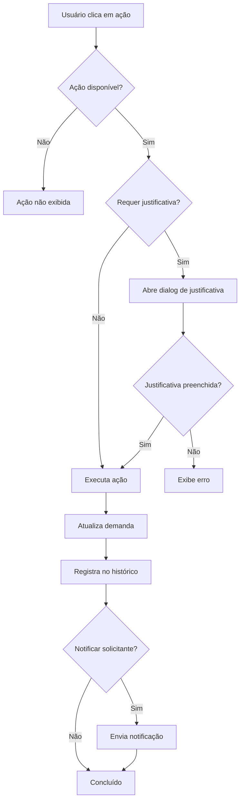

# Regras de Ações do Kanban

Este documento descreve as regras de exibição e permissão de ações implementadas no sistema de demandas/kanban.

## Regras Gerais

- **Visualizar Demanda**: Sempre disponível em todas as colunas
- **Incluir Comentário**: Sempre disponível em todas as colunas

## Regras por Ação

### 1. Visualizar Demanda
- **Disponibilidade**: Todas as colunas
- **Observações**: Abre o dialog com abas de Histórico, Form, Squad, Anexos e Comentários

### 2. Incluir Comentário
- **Disponibilidade**: Todas as colunas
- **Observações**: Integrado no histórico da demanda

### 3. Solicitar Avaliação Coordenador TI (Faseamento)
- **Disponibilidade**: Apenas nas colunas:
  - StandBy
  - Backlog
  - Arquivadas
  - Novas
  - Alteração de Escopo
- **Observações**: Envia a demanda para avaliação técnica

### 4. Avaliar Risco
- **Disponibilidade**: Apenas nas colunas:
  - StandBy
  - Backlog
  - Arquivadas
  - Novas
  - Alteração de Escopo
- **Pré-requisito**: Requer avaliação TI prévia
- **Observações**: 
  - Se alto risco → Move para Aguardando Comitê
  - Se baixo risco → Move para Aprovadas GP

### 5. Solicitar Insumo
- **Disponibilidade**: Apenas nas colunas:
  - StandBy
  - Backlog
  - Arquivadas
  - Novas
  - Alteração de Escopo
- **Observações**: Envia de volta para o solicitante e move para StandBy

### 6. Aprovar
- **Disponibilidade**: Todas as colunas, exceto:
  - Concluídas
  - Canceladas
- **Observações**:
  - Avança automaticamente para o próximo estágio permitido do fluxo
  - Valida regras específicas de transição (ex.: squad obrigatória para iniciar desenvolvimento)
  - Registra histórico e notifica o solicitante

### 7. Reprovar
- **Disponibilidade**: Todas as colunas, exceto:
  - Em Progresso
  - Concluídas
- **Exige justificativa**: Sim
- **Observações**:
  - Abre dialog solicitando motivo da reprovação
  - Notifica o solicitante

### 8. Cancelar
- **Disponibilidade**: Todas as colunas
- **Exige justificativa**: Sim
- **Observações**:
  - Abre dialog solicitando motivo do cancelamento
  - Move demanda para Arquivado
  - Notifica o solicitante

## Implementação Técnica

### Arquivos Modificados

1. **`src/utils/kanbanActionRules.ts`** (NOVO)
   - Contém as regras de negócio para visibilidade de ações
   - Funções helper: `isActionAvailable()`, `requiresJustification()`, `getAvailableActions()`

2. **`src/components/kanban/KanbanCard.tsx`**
   - Implementa validação condicional de ações baseada nas regras
   - Usa função `isActionAvailable()` para cada ação

3. **`src/components/kanban/KanbanColumn.tsx`**
   - Passa propriedade `hasTIApproval` para o KanbanCard
   - Verifica campo `aprovacao_tecnica_coordenador` da demanda

4. **`src/pages/empresa/KanbanView.tsx`**
   - Já possui validação de justificativa para Reprovar e Cancelar
   - Mantém funcionalidades existentes

## Fluxo de Validação

## Testes Recomendados

1. **Teste de visibilidade**: Verificar que as ações aparecem apenas nas colunas corretas
2. **Teste de aprovação TI**: Verificar que "Avaliar Risco" só aparece após aprovação TI
3. **Teste de justificativa**: Verificar que Cancelar e Reprovar exigem motivo
4. **Teste de notificação**: Verificar que solicitante recebe notificação
5. **Teste de histórico**: Verificar que todas as ações são registradas
